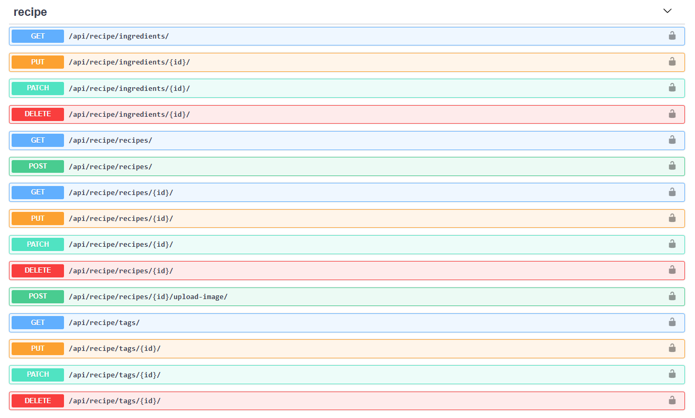
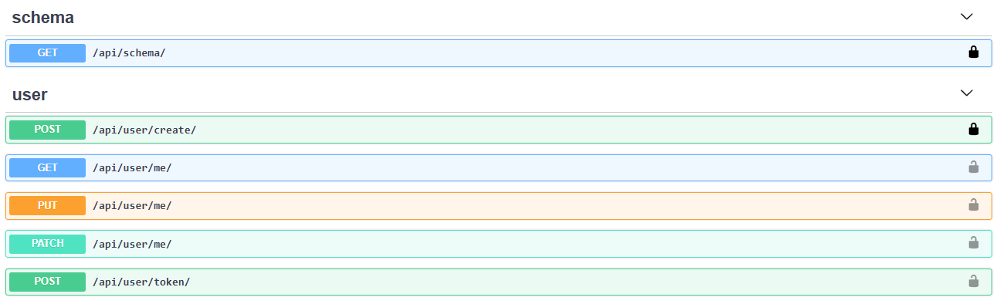

# Django REST API Recipe Project





## Project Overview

This is a Recipe API built with Django and Django REST Framework. The API allows users to upload and store their favorite recipes, including those from photos and the web. This project serves as a demonstration of my skills in Python, Django, Docker, and Test Driven Development (TDD), showcasing a robust backend REST API.

## Key Features

- User authentication
- Creating and updating user profiles
- Creating and managing recipe objects
- Filtering and sorting recipes
- Uploading and viewing images
- Adding tags to recipes (e.g., "vegan", "dessert")

## Tech Stack

- Python 3.9
- Django 3.2
- Django REST Framework 3.12
- Docker & Docker-Compose
- PostgreSQL
- GitHub Actions

## Project Highlights

- Project setup using Docker and Docker-Compose
- Implementation of Test Driven Development (TDD)
- Unit tests written using Django Test Framework
- Automated code checks and unit tests via GitHub Actions
- Customized Django admin interface
- Handling of media file uploads
- Application of best practice principles

## Installation and Usage

This project uses Docker for easy setup and deployment. 

For development, the Docker setup uses volume mounting to reflect changes in real-time. Any changes you make to the Python code will be immediately reflected in the running application.

Follow these steps to get the project running on your local machine:

### Prerequisites

- Docker
- Docker Compose

### Steps

1. Clone the repository:

    ```
    git clone https://github.com/linhung0319/recipe-app-api.git
    ```

2. Build the Docker image:

    ```
    docker build .
    ```

3. Run the Docker containers:

    This command will start the containers.

    ```
    docker-compose up
    ```

4. The application should now be running. You can access it through your web browser or API client.

    The API will be available at `http://localhost:8000`.

### Database Migrations

The docker-compose file is configured to run migrations automatically when the container starts. However, if you need to run migrations manually, you can use:

```
docker-compose run --rm app sh -c "python manage.py migrate"
```

### Running Tests

To run the test suite:

```
docker-compose run --rm app sh -c "python manage.py test"
```

## API Documentation

This project provides a comprehensive RESTful API for managing recipes, ingredients, and tags. The API is built using Django REST Framework and follows OpenAPI 3.0.3 specifications.

### API Features

- User authentication and management
- CRUD operations for recipes, ingredients, and tags
- Image upload for recipes
- Filtering and sorting capabilities for recipes

### API Endpoints

Here's a brief overview of the main API endpoints:

1. User Management:
   - Create User: `POST /api/user/create/`
   - Get/Update User Profile: `GET/PUT/PATCH /api/user/me/`
   - Create Auth Token: `POST /api/user/token/`

2. Recipe Management:
   - List/Create Recipes: `GET/POST /api/recipe/recipes/`
   - Retrieve/Update/Delete Recipe: `GET/PUT/PATCH/DELETE /api/recipe/recipes/{id}/`
   - Upload Recipe Image: `POST /api/recipe/recipes/{id}/upload-image/`

3. Ingredient Management:
   - List Ingredients: `GET /api/recipe/ingredients/`
   - Update/Delete Ingredient: `PUT/PATCH/DELETE /api/recipe/ingredients/{id}/`

4. Tag Management:
   - List Tags: `GET /api/recipe/tags/`
   - Update/Delete Tag: `PUT/PATCH/DELETE /api/recipe/tags/{id}/`

### Authentication

This API uses token-based authentication. To access protected endpoints, include the token in the Authorization header:

```
Authorization: Token <your-token>
```

### Detailed API Documentation

For a complete and interactive API documentation, you can use the built-in Swagger UI:

- Swagger UI: `/api/docs/`
- OpenAPI Schema: `/api/schema/`

These endpoints provide a detailed view of all available API endpoints, request/response schemas, and allow you to try out the API directly from the browser.

## Contact Information
If you have any questions or suggestions about this project, feel free to contact me:
- Email: linhung0319@gmail.com
- Portfolio: [My Portfolio](https://linhung0319.vercel.app/)
- Linkedin: [My Linkedin](https://www.linkedin.com/in/hung-lin/)